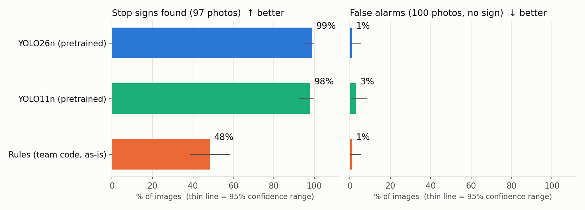
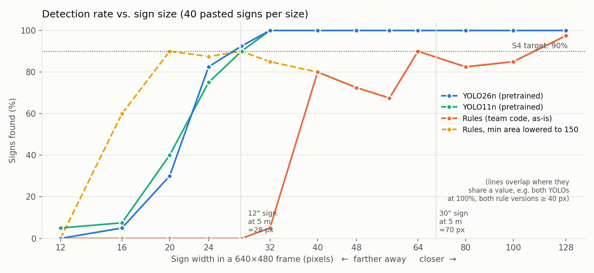
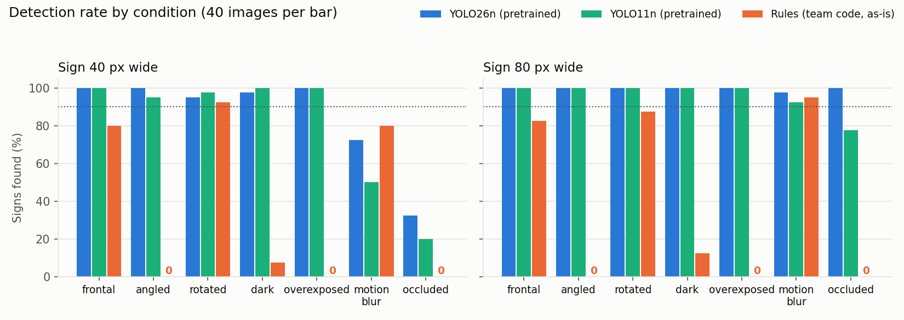
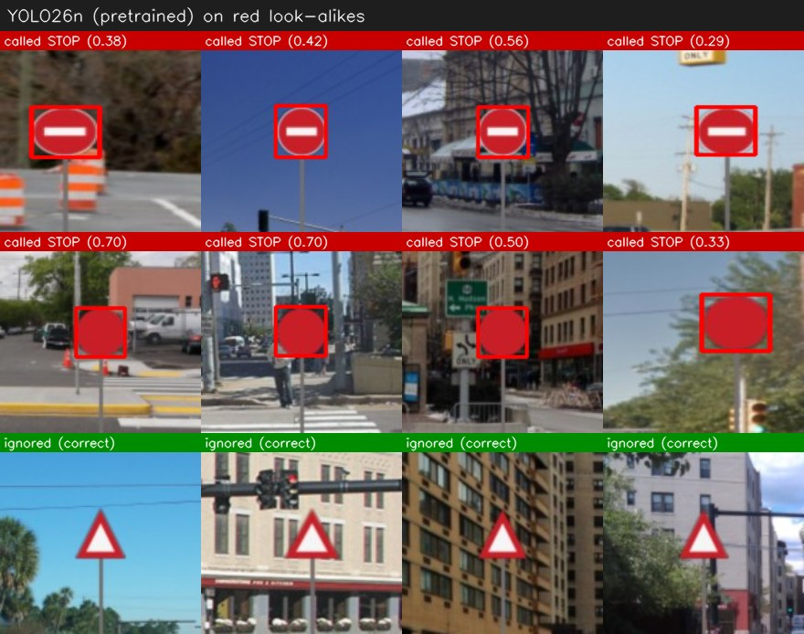

# Stop sign detection: team rules vs pretrained YOLO nano

*Cosmo delivery robot (ECE 49022 Team 22) · test run 2026-10-05 · reproducible with the scripts in this folder*

## Bottom line

**Pretrained YOLO26n, with no training at all, beat the team's rule-based detector on every test except raw speed.** On 197 real street photos it found **96 of 97 stop signs (99%)** with 1 false alarm. The rules found **47 of 97 (48%)**, also with 1 false alarm.

Against stretch requirement **S4** (detect at ≥ 5 m, ≥ 90% of the time, daylight):

- **YOLO passes** for any sign 12" or larger.
- **The rules fail.** They see 0% of 12" signs at 5 m, and about 85% of full-size 30" signs.

YOLO has one clear weakness to fix before relying on it: it often calls **red round signs on poles** (e.g. "do not enter") a stop sign.

| Detector | Signs found (97 real photos) | False alarms (100 real photos) | Smallest sign found ≥ 90% of the time | Time / frame* |
|---|---|---|---|---|
| **YOLO26n (pretrained)** | **96 = 99%** | 1 = 1% | **28 px** | 60 ms |
| YOLO11n (pretrained) | 95 = 98% | 3 = 3% | 28 px | 64 ms |
| Rules (team code, as-is) | 47 = 48% | 1 = 1% | 128 px | 2 ms |
| Rules, min area lowered 800 → 150 | 56 = 58% | 12 = 12% | 128 px | 2 ms |

\*Median on the 2-core cloud machine used for this test (PyTorch on CPU). Not a Pi number: Ultralytics measures YOLO26n at ~67 ms per frame on a Pi 5 after exporting it to NCNN.

## What was tested

Both detectors received exactly the same input: every image scaled to 640 px wide, the robot camera's resolution. The rules ran on single frames, without the 3-frame confirmation, since these are still images; that confirmation can only remove detections, never add them. YOLO used Ultralytics' default confidence threshold of 0.25 unless stated otherwise.

1. **Real photos (197):** street-level photos from [mbasilyan/Stop-Sign-Detection](https://github.com/mbasilyan/Stop-Sign-Detection). 97 contain a stop sign and 100 don't; the negatives are full of red cars, brick, traffic lights and other signs. These photos are not part of COCO, the dataset YOLO was trained on.
2. **Controlled set (1,180 images):** 15 real stop signs cut out of those photos and pasted onto the 100 sign-free street photos, so the exact sign size and position are known:
   - **Distance sweep:** sign widths from 12 to 128 px, 40 images per size.
   - **Conditions:** angled (~55° to the side), rotated 12–20°, dark (30% brightness), overexposed, motion blur, and a pole covering about 30% of the sign. Each is tested at 40 px and 80 px, 40 images each.
   - **Red look-alikes:** "do not enter"-style discs, plain red discs, and red-bordered triangles, 60 of each, all on poles.

## Distance (S4)

To turn pixels into metres, I assumed a typical USB webcam: 640 px wide with a 70° horizontal field of view. Edit `CAM_HFOV_DEG` in `evaluate.py` once you know your camera's real field of view.

| Sign | Width at 5 m | Width at 8 m |
|---|---|---|
| 12" mini sign | 28 px | 17 px |
| 18" | 42 px | 26 px |
| 24" | 56 px | 35 px |
| 30" standard road sign | 70 px | 44 px |

- **YOLO26n** finds 92% of signs at 28 px and 100% from 32 px up. That's ≥ 90% for a 12" sign at 5 m, and for a 30" sign out to about 12 m.
- **Rules (as-is)** find nothing below 32 px. The `MIN_AREA = 800` setting throws away every blob smaller than roughly a 31-px octagon. Above that size the rules still plateau at 70–90%:
  - Faded or dark-maroon signs fail the HSV red threshold. One of the 15 pasted signs was *never* detected at any size.
  - Corner counting is noisy, so some real octagons come out with fewer than 7 or more than 10 corners.
- **Lowering the min area to 150** lets the rules see small signs (90% at 20 px, slightly better than YOLO at that size). But the false-alarm rate on real photos jumps from 1% to 12%, and nothing improves for larger signs.

## Conditions

- The rules score **0% on angled signs**, because the width/height check rejects anything narrower than 0.75. They also score **0% when overexposed** (red loses saturation), **~10% in the dark** (brightness falls below 70), and **0% when a pole is in front** (the sign splits into two blobs).
- YOLO is at or near 100% everywhere except two cases with *small* (40 px) signs: **motion blur (72%)** and **occlusion (32%)**. At 80 px both are back to 98–100%. Slowing down or briefly pausing before reading a sign would help.

## YOLO's weak spot: red round signs

| Called a stop sign | "Do not enter" disc | Plain red disc | Red triangle |
|---|---|---|---|
| YOLO26n, confidence ≥ 0.25 (default) | 68% | 65% | 0% |
| YOLO26n, confidence ≥ 0.50 | 38% | 27% | 0% |
| Rules (as-is) | 93% | 93% | 0% |

- Both detectors are fooled by red round shapes on poles. The rules are fooled more often, because their simplification turns a circle into ~8 corners.
- Raising YOLO's threshold to 0.5 roughly halves these false alarms. The cost on real photos is small: detection drops from 99% to 96%, and false alarms fall to 0%.
- These look-alikes were drawn as flat graphics, so they may be harder than real signs: in the one real "do not enter" sign in the photo set (183.jpg), YOLO ignored it correctly. Still, campuses have plenty of these signs, so this needs testing on real footage.
- The 3-frame confirmation won't fix this, because the mistake repeats on every frame. The real fix is to **fine-tune YOLO** on a few hundred labelled campus images that include these signs as negatives.

## Every mistake on the real photos

- YOLO26n's two mistakes:
  - **39.jpeg:** missed a clear sign.
  - **167.jpg:** called a small blue-and-red route-marker sign a stop sign.
  - See `results/gallery_mistakes_yolo26n.jpg`.
- The rules missed 50 signs, mostly small or distant ones, plus some large, clear ones such as 68.jpeg, 74.jpg and 89.jpg. They had one false alarm, a red object in 134.jpg. See `results/gallery_mistakes_rules.jpg`.

## Caveats

- **The photos are from the internet, not from Cosmo.** Mostly car or pedestrian height, daylight, full-size road signs. Results on your camera, mounting height and test sign will differ. This is the most important thing to test next.
- **Real photos are scored per image** ("did it say there's a sign?"), with no box check. I checked by eye that YOLO's boxes on the small, hard positives really were on the sign. Two photos appear twice (21/98 and 24/57).
- **The pasted signs were picked from large signs YOLO had already found,** and cut out using a red mask. This could flatter either detector slightly, but it doesn't change the size of the gap.
- **The "dark" test is a dimmed daylight photo,** not real night with headlights and glare. S4 only asks for daylight.

## Recommendation and next steps

1. **Switch to YOLO26n** for stop signs. Use a confidence threshold of about **0.5**, and keep a 3-out-of-5-frame confirmation before stopping.
2. **Test on Cosmo's own footage:**
   - Record the robot camera approaching the real test sign from about 10 m.
   - Record the route with no sign, including do-not-enter signs, red cars and fire hydrants.
   - Drop the frames into `data/real/` and run `evaluate.py` (see README).
3. **If look-alikes show up in that footage,** fine-tune YOLO26n on about 200–500 labelled campus frames. The free Ultralytics/Roboflow tools handle the labelling and training; it takes about an hour on a laptop GPU or Colab.
4. **Benchmark on the Pi:**
   - Export with `yolo export model=yolo26n.pt format=ncnn` (or `imgsz=320` for speed).
   - Measure whole-pipeline FPS and CPU load *while* LiDAR and the planner are running.
   - Only buy the AI HAT+ if the CPU can't keep up.
